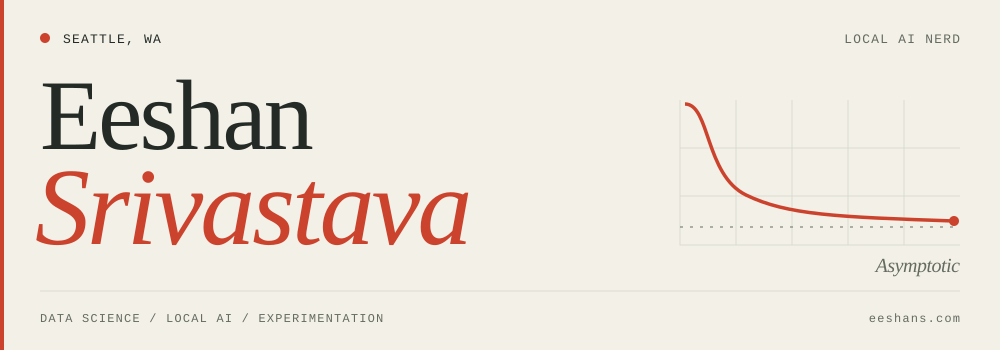

<picture>
  <source media="(prefers-color-scheme: dark) and (max-width: 600px)" srcset="assets/header-mobile-dark.svg">
  <source media="(max-width: 600px)" srcset="assets/header-mobile.svg">
  <source media="(prefers-color-scheme: dark)" srcset="assets/header-dark.svg">
  
</picture>

📍 Seattle | ☕ Sr. Data Science Manager @ Starbucks | 🤖 Local AI Nerd | ✍️ Writing at [Asymptotic](https://eeshans.com/writing)

I have a computer science & data science background. Currently leading large-scale recommender systems & experimentation projects for a global consumer brand. In my spare time, I like exploring how to assess reliability & trust in LLMs, along with ultra-low cost implementations of LLMs in Data Science & ML use cases. I believe in human-centric approaches to using new technology, not replacing them.

### Local AI Execution, LLM Benchmarks & Evals

<table>
<tr>
<td width="50%" valign="top">
<h3><a href="https://github.com/eeshansrivastava89/minimal-ai">Minimal AI</a></h3>

wrapper that stitches llama.cpp, oMLX and Pi to easily run local models on Mac

</td>
<td width="50%" valign="top">
<h3><a href="https://github.com/eeshansrivastava89/local-llm-visual-benchmark">Local LLM Visual Bench</a></h3>

benchmarking local AI models such as Qwen 3.6 and Gemma 4 with visual / animation prompts

</td>
</tr>
</table>

### LLM + Data Science & ML Use Cases

- [How I Prompt](https://github.com/eeshansrivastava89/howiprompt) — analyze your prompting activity and language patterns for Claude, Codex, Pi, OpenCode etc.
- [A/B Testing Memory Game](https://github.com/eeshansrivastava89/ab-simulator) — live A/B test using a memory game puzzle concept, with always-on stats & python analysis
- [Weather App](https://github.com/eeshansrivastava89/weather-app) — weather explorer for US ZIP codes with current, historical, and forecast data

### Other useful tools

- [age-vault](https://github.com/eeshansrivastava89/age-vault) — cli for encrypting / decrypting files using age (very useful for protecting files & folders from LLMs)
- [Quizzard](https://github.com/eeshansrivastava89/quizzard) — if you don't want to pay for Kahoot
- [Sidequests](https://github.com/eeshansrivastava89/sidequests) — track the health & get AI summaries of your slopware sidequests (maybe it helps you clean things up)

---

**Reach Me** | [LinkedIn](https://www.linkedin.com/in/eeshans/) | [Twitter / X](https://x.com/notesundrground) | [eeshans.com](https://eeshans.com)
